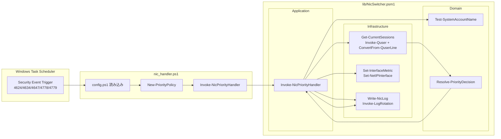
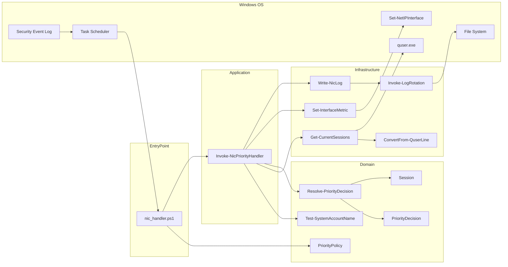
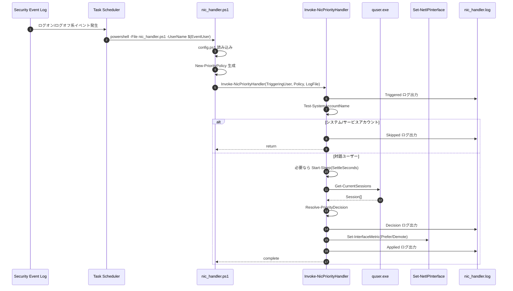
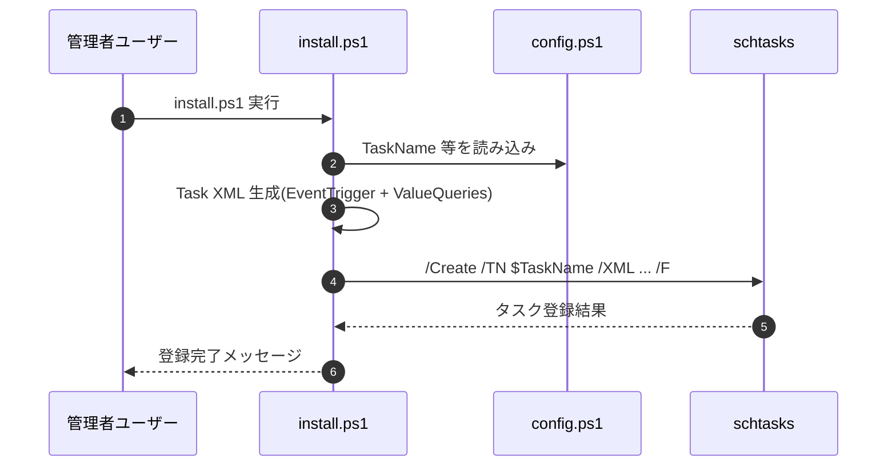
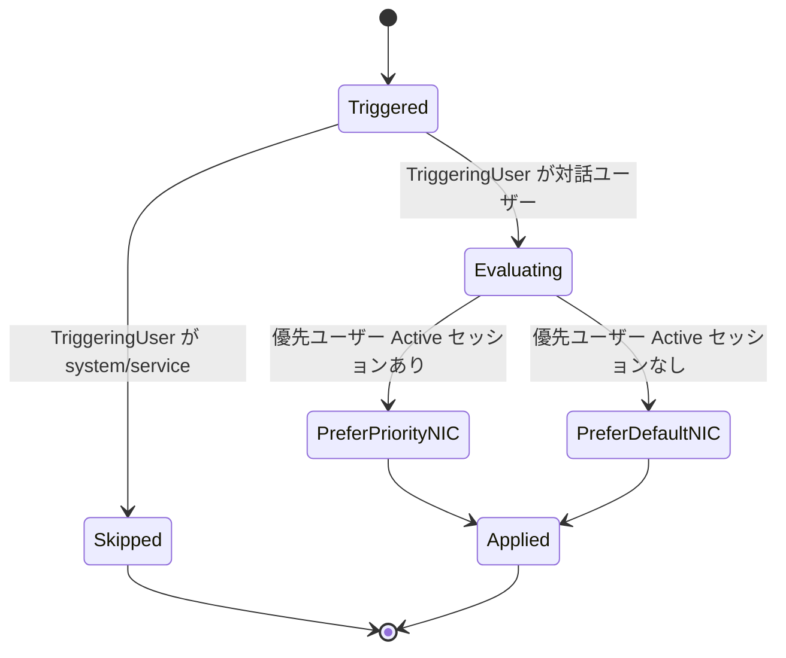
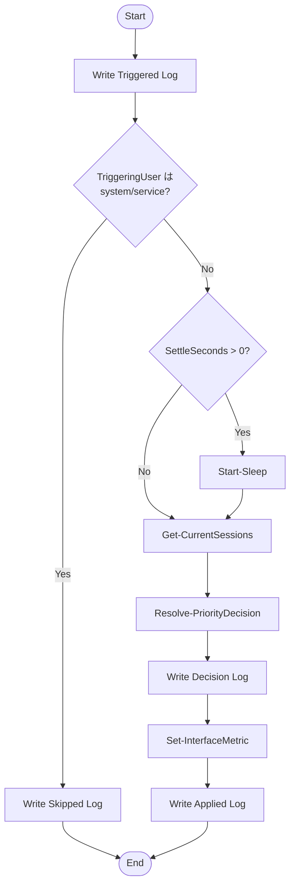
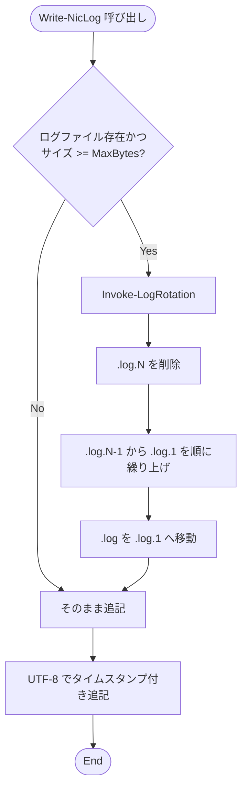

# nic-switcher システム仕様書

## 1. 目的

nic-switcher は、Windows のログオン関連イベントを契機として、現在アクティブなユーザーセッションに応じて 2 つの NIC の優先度（InterfaceMetric）を自動切り替えする仕組みである。

主目的は次の通り。

- 優先ユーザー（例: 業務用ユーザー）がアクティブなときは業務用 NIC を優先。
- 優先ユーザーがアクティブでないときは通常 NIC を優先。
- 判定と適用の履歴を UTF-8 ログへ監査記録。

## 2. システム境界と依存

### 2.1 入力

- Security イベントログ（イベント ID: 4624, 4634, 4647, 4778, 4779）
- イベント内 TargetUserName（タスク引数 UserName として受け渡し）
- 現在のセッション一覧（quser.exe）
- ローカル設定（config.ps1）

### 2.2 出力

- NIC メトリック変更（Set-NetIPInterface）
- ログファイル追記（nic_handler.log、UTF-8）
- ログローテーション（.log.1, .log.2 ...）

### 2.3 前提条件

- install.ps1 / uninstall.ps1 は管理者権限で実行。
- 実運用時の NIC 書き換えには管理者権限が必要。
- config.ps1 が存在し、整合した値を持つこと。

## 3. アーキテクチャ

実装は Domain / Infrastructure / Application の 3 層で構成される。

## 4. コンポーネント仕様

## 5. 実行シーケンス

### 5.1 イベント発生から NIC 切り替えまで

### 5.2 インストール時

## 6. 状態遷移仕様

このシステムは「優先判定状態」と「適用状態」の 2 段階で遷移する。

## 7. 判定アルゴリズム仕様

### 7.1 セッション取得と正規化

- quser.exe の各行を ConvertFrom-QuserLine で解析。
- Active または Disc を含む行のみ有効なセッション行として採用。
- Disc は内部状態 Disconnected に正規化。
- セッション行先頭の > は除去。

### 7.2 優先判定

- 条件: Session.UserName が PriorityPolicy.Pattern に正規表現一致し、かつ Session.State = Active。
- 上記を満たすセッションが 1 件でもあれば、PriorityInterfaceIndex を優先。
- 1 件もなければ、DefaultInterfaceIndex を優先。

### 7.3 NIC 適用

- 優先側 NIC: PreferredMetric を設定。
- 非優先側 NIC: DemotedMetric を設定。
- 2 回の Set-NetIPInterface 呼び出しで適用。

## 8. フローチャート

### 8.1 ハンドラ本体

### 8.2 ログローテーション

## 9. データ定義

### 9.1 Session

- UserName: string
- State: Active | Disconnected

### 9.2 PriorityPolicy

- Pattern: string（正規表現）
- PriorityInterfaceIndex: int
- DefaultInterfaceIndex: int
- PreferredMetric: int
- DemotedMetric: int

### 9.3 PriorityDecision

- PreferIndex: int
- DemoteIndex: int
- PreferMetric: int
- DemoteMetric: int
- Reason: string

## 10. 設定仕様（config.ps1）

- PriorityUserPattern: 優先ユーザー判定正規表現
- PriorityInterfaceIndex: 優先候補 NIC
- DefaultInterfaceIndex: 通常候補 NIC
- PreferredMetric: 優先側メトリック（小さいほど優先）
- DemotedMetric: 非優先側メトリック
- TaskName: スケジューラタスク名
- LogFile: ログ出力先
- MaxLogBytes: ローテーション閾値
- MaxLogBackups: 保持世代数

## 11. 不変条件とエラーハンドリング

- New-PriorityPolicy は次を拒否する。
  - PriorityInterfaceIndex と DefaultInterfaceIndex が同値
  - PreferredMetric >= DemotedMetric
- TriggeringUser が system/service の場合は処理スキップし副作用なし。
- Get-CurrentSessions で quser 出力が空の場合は空配列扱い。
- ローテーション失敗時も Write-NicLog 本体は継続（監査停止を回避）。

## 12. テストで検証済みの仕様範囲

- Domain: 判定ルール、不変条件、システムアカウント除外
- Infrastructure: quser 行解析、セッション取得境界、NIC 適用呼び出し、UTF-8 ログ、ローテーション
- Application: トリガー受信から判定・適用・ログ出力までのオーケストレーション
- 結合観点: 実 quser、実ファイル I/O、-WhatIf 経由の安全性確認

## 13. 制約事項

- 対象は 2 つの NIC の優先/降格切り替えモデル。
- セッション状態判定は quser の Active / Disc トークン前提。
- インストール時タスクは SYSTEM 権限で実行されるため、スクリプト改変リスク管理が必要。

## 14. 運用上の注意

- config.ps1 と nic_handler.log は機微情報を含むためリポジトリ管理対象外とする。
- モジュール更新後は install.ps1 の再実行でタスク XML の実行パスを最新化する。
- 本番反映前に tests/Run-Tests.ps1 と必要に応じて tests/verify-on-real-machine.ps1 で検証する。
